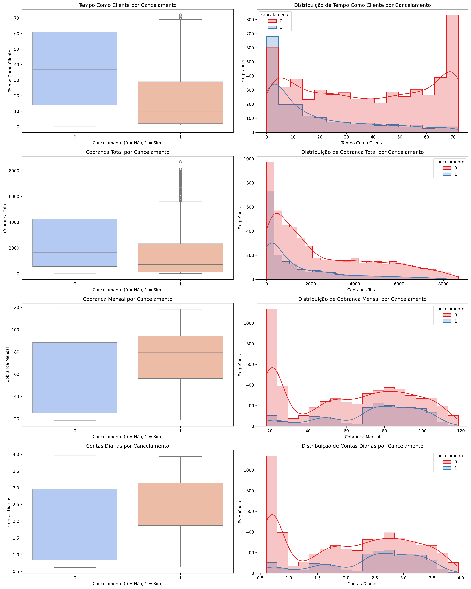

# Challenge-TelecomX

# Análise de Evasão de Clientes (Churn) - Telecom X

## 🧠 Introdução

Este projeto teve como objetivo analisar os dados da empresa **Telecom X** para entender os principais fatores que influenciam a **evasão de clientes (Churn)**. Através de uma abordagem estruturada com **limpeza de dados, análise exploratória e visualizações**, buscamos responder à pergunta:  
**"O que faz um cliente cancelar seu contrato?"**

---

## 🧼 Limpeza e Tratamento de Dados

As principais etapas realizadas foram:

- **Importação e normalização** dos dados no formato `.json`.
- **Conversão de colunas numéricas** com tipos inconsistentes (`object` → `float`).
- **Padronização de valores categóricos**: lowercase, underscores e substituição de espaços.
- **Transformação de variáveis binárias** (‘sim’/‘não’, ‘yes’/‘no’) para valores numéricos (1 e 0).
- Criação da feature `contas_diarias` para representar a cobrança diária média do cliente.

---

## 📊 Análise Exploratória de Dados (EDA)

Diversas visualizações e agrupamentos foram usados para encontrar padrões entre os clientes que **cancelaram** e os que **permaneceram**.

---

### 🔍 1. Tempo Como Cliente vs Cancelamento

#### 📦 Boxplot
- **Grupo 0 (não cancelou)**:
  - Mediana: ~40 meses
  - Distribuição ampla (até 72 meses)
- **Grupo 1 (cancelou)**:
  - Mediana: ~10 meses
  - Maioria cancelou com menos de 15 meses

✅ **Interpretação**:  
Clientes que cancelam geralmente são novos. A evasão precoce é um padrão forte aqui.

#### 📈 Histograma
- **Curva vermelha (cancelou)**: concentrada nos 0–10 meses
- **Curva azul (ficou)**: cresce com o tempo

✅ **Refinamento**:  
A chance de churn diminui drasticamente após 20 meses.

📌 **Insight estratégico**:  
**Os primeiros 3 a 6 meses são críticos**. Investir forte em retenção nesse período.

---

### 🔍 2. Cobrança Total vs Cancelamento

#### 📦 Boxplot
- Clientes que não cancelaram têm **cobrança total maior e mais distribuída**.
- Clientes que cancelaram gastaram **muito pouco antes de sair**.

✅ **Interpretação**:  
Churn está relacionado ao **baixo investimento acumulado** — ou seja, saem rápido e cedo.

#### 📈 Histograma
- **Curva vermelha** (cancelou): alta para valores baixos de cobrança (~0–1000).
- **Curva azul** (ficou): aparece mais nos valores altos (>3000).

📌 **Insight estratégico**:  
Clientes que permanecem têm **lifetime value** maior. Precisa **aumentar o valor percebido logo no início**.

---

### 💰 3. Custo Mensal (cobranca_mensal) vs Cancelamento

#### 📦 Boxplot
- Clientes que cancelaram pagam **mais por mês** do que os que ficaram.
- Mediana dos cancelados: **> R$75**
- Mediana dos que ficaram: **< R$75**

#### 📈 Histograma
- **Curva vermelha (cancelou)**: concentrada entre R$60 e R$100
- **Curva azul (ficou)**: mais distribuída e com picos nos valores mais baixos

✅ **Interpretação**:  
**Clientes com mensalidade alta têm maior risco de churn**, especialmente se não percebem valor agregado.

📌 **Insight**:  
**Sensibilidade a preço é real.** Se o serviço não justificar o custo, o cancelamento vem.

---

### 📌 Contrato

| Tipo de Contrato | Taxa de Cancelamento |
|------------------|-----------------------|
| Month-to-month   | **41,3%**             |
| One year         | 10,9%                 |
| Two year         | 2,8%                  |

➡️ **Clientes com contrato mensal são os mais propensos a cancelar.**

---

### 💳 Método de Pagamento

| Método de Pagamento           | Churn (%) |
|-------------------------------|-----------|
| Electronic Check              | **43,8%** |
| Mailed Check                  | 18,5%     |
| Bank Transfer (Automatic)     | 16,2%     |
| Credit Card (Automatic)       | 14,8%     |

➡️ **Pagamentos manuais estão ligados à maior evasão.**

---

### 🎁 Serviços Adicionais

| Serviço              | Cancelamento (%) |
|----------------------|------------------|
| Sem Backup Online    | 38,7%            |
| Com Backup Online    | 20,9%            |
| Sem Suporte Técnico  | 30,2%            |
| Com Suporte Técnico  | 14,7%            |
| Sem Streaming TV     | 23,6%            |
| Com Streaming TV     | 29,2%            |

➡️ Clientes **sem serviços extras** tendem a sair mais.

---

### 👨‍👩‍👧 Perfil Familiar

| Situação              | Churn (%) |
|-----------------------|-----------|
| Sem Companheiro(a)    | 32,0%     |
| Com Companheiro(a)    | 19,0%     |
| Sem Dependentes       | 30,3%     |
| Com Dependentes       | 14,9%     |

➡️ Ter família parece ser um fator de retenção.

---

### 🌐 Tipo de Internet

| Tipo de Internet | Churn (%) |
|------------------|-----------|
| Fiber Optic      | **40,6%** |
| DSL              | 18,4%     |
| Sem Internet     | 7,1%      |

➡️ Aparentemente, **clientes de fibra óptica estão mais insatisfeitos**, mesmo com melhor tecnologia.

---

### 👥 Gênero

| Gênero   | Cancelamento (%) |
|----------|------------------|
| Feminino | 26,0%            |
| Masculino| 25,0%            |

➡️ **Gênero não influencia significativamente o churn.**

---

## ✅ Resumo das Interpretações

| Variável           | Cancelamento | Padrão Identificado                        | Ação Sugerida                                              |
|--------------------|--------------|--------------------------------------------|-------------------------------------------------------------|
| Tempo como Cliente | 1 (Sim)      | Sai cedo, geralmente < 15 meses            | Estratégias de onboarding e fidelização nos primeiros meses |
| Cobrança Total     | 1 (Sim)      | Gastaram pouco → saíram cedo               | Aumentar valor percebido rapidamente                        |
| Custo Mensal       | 1 (Sim)      | Pagam mais por mês                         | Oferecer mais valor ou plano mais acessível                |

---

## ✅ Recomendações

1. **Incentivar migração para contratos de 1 ou 2 anos** com benefícios (ex: desconto no primeiro mês).
2. **Oferecer bônus ou descontos para quem adotar pagamento automático**.
3. Criar **campanhas de retenção** focadas em clientes com **cobrança mensal alta**.
4. Promover **serviços extras gratuitos por tempo limitado** (ex: backup ou suporte técnico) como estratégia de fidelização.
5. **Investigar insatisfação de clientes com fibra óptica**, já que esse grupo apresenta churn elevado.
6. **Foco total nos primeiros 3 a 6 meses** do cliente com onboarding, atendimento personalizado e percepção de valor.

---

## 📁 Tecnologias Utilizadas

- Python
- Pandas
- NumPy
- Matplotlib
- Seaborn
- Google Colab

---

## 📌 Resultado Esperado

Com as estratégias baseadas nos dados analisados, espera-se **reduzir a taxa de evasão** e aumentar a fidelização dos clientes, tornando a Telecom X mais competitiva e lucrativa.

---

**Autora**: Tayara 👩‍💻  
**Objetivo**: Aprendizado prático em análise de dados, churn e tomada de decisão com base em evidências.  

